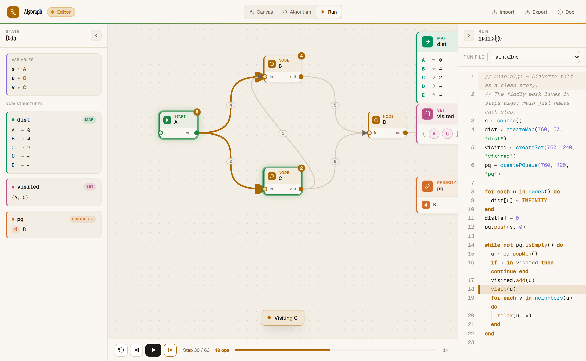
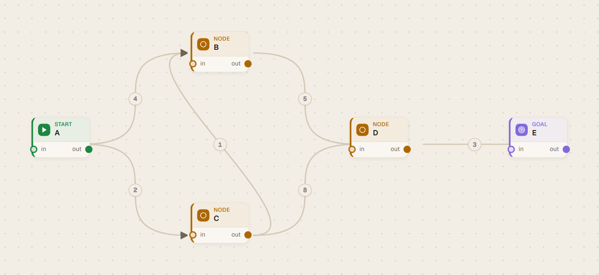
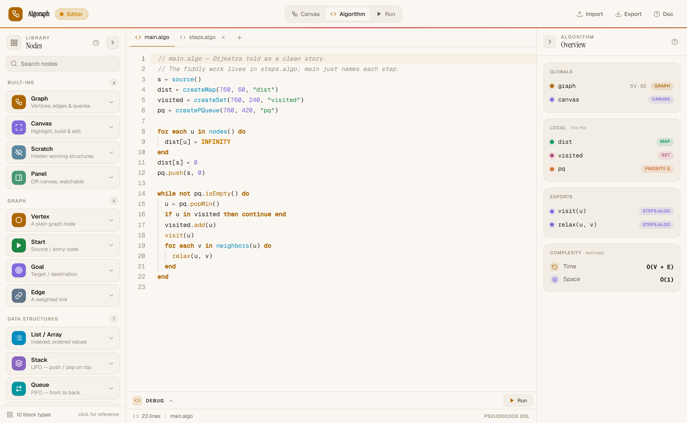
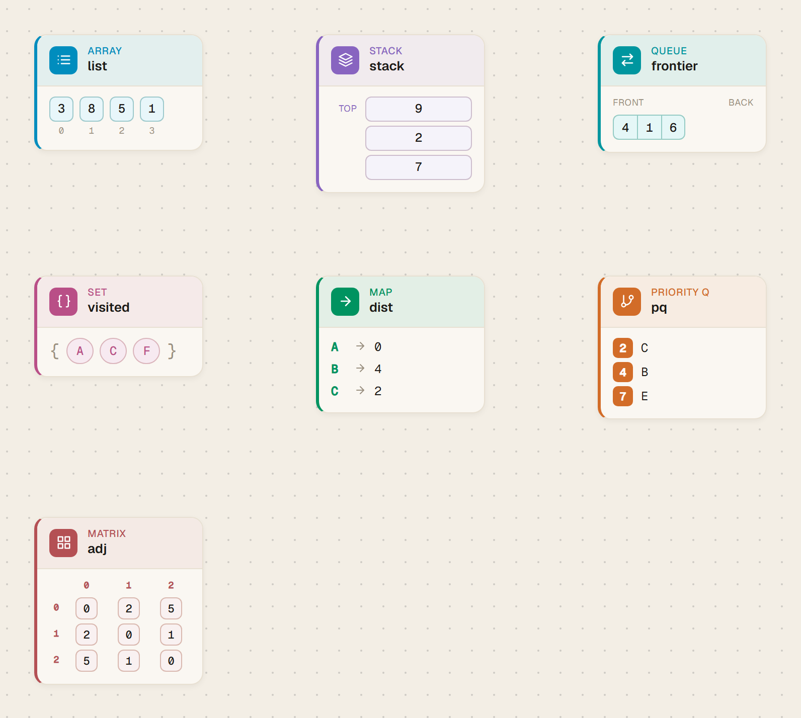

<div align="center">

# Algoraph

### Watch algorithms run.

Build a graph, write it up in a small pseudocode language, then step through it
one operation at a time — every vertex it visits lights up on the canvas, and
every operation is counted, so an algorithm's complexity becomes something you
can *see* rather than just read about.

[](https://angular.dev)
[](https://www.typescriptlang.org)
[](https://codemirror.net)
[](https://flow.foblex.com)
[](https://vitest.dev)
[](#tech-stack)
[](LICENSE)

<br/>



</div>

---

## What is Algoraph?

Algoraph is an interactive **graph-algorithm learning platform** that runs
entirely in your browser — no backend, no sign-up, nothing to install. It's
built for the moment a textbook says *"Dijkstra is O((V + E) log V)"* and you
want to actually **watch why**.

You work in three connected workspaces:

| | Workspace | What you do |
|---|---|---|
| 🟢 | **Canvas** | Draw the graph — vertices, weighted directed/undirected edges, and any data structures the algorithm needs. |
| `</>` | **Algorithm** | Write the algorithm in a CLRS-style pseudocode DSL, with autocomplete, inline error underlines, and per-line notes. |
| ▶ | **Run** | Play it step by step. Highlights move across the canvas, loops ring themselves, data structures fill live, and the operation count + estimated Big-O grow as it goes. |

---

## How it works

### 1 · Build a graph

Drop vertices onto the canvas, drag between ports to connect them, and
double-click an edge to set its weight and direction. Mark one vertex as
**Start** and, for a search, one as **Goal** — your code reaches them with
`source()` and `goal()`.

<div align="center">

</div>

### 2 · Write the algorithm

Write in Algoraph's pseudocode. Each file is a tab and `main` is the entry
point. The editor converts ASCII shortcuts as you type (`<-` → `←`, `<=` → `≤`),
completes names in scope, and underlines mistakes before you ever press Run.

```
s ← source()
for each u in nodes() do
  dist[u] ← INFINITY
end
dist[s] ← 0
pq.push(s, 0)

while not pq.isEmpty() do
  u ← pq.popMin()
  if u in visited then continue end
  visited.add(u)
  visit(u)                       // one call = one readable step
  for each v in neighbors(u) do
    relax(u, v)
  end
end
```

Keep `main` at the level of the *idea* and push the highlighting, labels and
bookkeeping into `export function` helpers in their own module file — the Run
treats each call as a single step, so the audience reads the story, not the
plumbing.

<div align="center">

</div>

### 3 · Run it step by step

Algoraph compiles your algorithm and steps through it line by line, right on the
graph. Play, pause, step back and forth, and slow the speed down to study a
tricky part. The step counter, the running **operation count**, and the
estimated **Big-O** are all in view — giving the growing cost a shape you can
name.

---

## Features

- **Step debugger on a live graph** — every line maps to a visual: vertices and
  edges highlight, labels pin distances, snackbars narrate.
- **Operation counting + Big-O estimate** — see the cost grow and the complexity
  it implies, instead of taking the textbook's word for it.
- **A real little language** — lexer → parser → resolver → interpreter, with
  functions, modules (`export`), short-circuiting boolean logic, ranges, and
  friendly diagnostics. ([`src/app/lang/`](src/app/lang))
- **Seven built-in data structures** — List, Stack, Queue, Set, Map, Priority
  Queue and Matrix, each drawn on the canvas and filling as the algorithm runs.
- **Self-visualizing loops** — the vertex a `for each` is on is ringed
  automatically, nested loops ring each level, and a popup lists what's left.
- **Sandbox canvas editing** — build graphs from code (`createNode`,
  `createEdge`, …); changes roll back after the run unless you `saveCanvas()`.
- **Save, share & open** — everything lives in files you keep. Export a `.algo`
  and a canvas `.json`, hand both to a student, and they watch *your* algorithm
  run on *your* graph. A small library ships in-app to start from.
- **Built-in docs** — a full getting-started guide, the complete language
  reference, and an API catalog, all a click away inside the app.

---

## The pseudocode at a glance

```
x ← e                       // assignment (type <- to get ←)
=  ≠  <  >  ≤  ≥             // comparison
and  or  not                // short-circuiting boolean logic
x in C        a..b          // membership · inclusive integer range

if cond then … else … end           // conditionals
while cond do … end                 // loop while a condition holds
for each x in C do … end            // iterate a collection
for i in a..b do … end              // counted loop

function f(p) do … end              // file-private helper
export function f(p) do … end       // callable from any file (no import)
return e
```

**Graph access** — `nodes()`, `edges()`, `neighbors(u)`, `weight(u, v)`,
`hasEdge(u, v)`, `degree(u)`, `source()`, `goal()`.

**Visualization** — `mark(u)` / `mark(u, v, "success")`, `setLabel(u, text)`,
`scrollTo(u)`, `showMessage(text)`, `clearMarks()`.

### Data structures

Drop a structure on the canvas, refer to it by name, and watch it fill as the
algorithm runs. Lists, maps and matrices use bracket indexing; stacks, queues,
sets and priority queues use methods. The operation counter charges each call.

<div align="center">

</div>

```
arr[i]   ·  arr.push(x)            // List / Array
st.push(x)  ·  st.pop()            // Stack — LIFO
q.enqueue(x)  ·  q.dequeue()       // Queue — FIFO
s.add(x)  ·  x in s                // Set
m[k]  ·  k in m  ·  m.keys()       // Map
pq.push(x, p)  ·  pq.popMin()      // Priority queue — min-heap
M[i][j]  ·  M.rows()               // Matrix
```

---

## Getting started

Requires [Node.js](https://nodejs.org) (with npm). The project pins
`npm@11.6.2`.

```bash
git clone https://github.com/Kaandroids/algoraph.git
cd algoraph
npm install

npm start        # dev server at http://localhost:4200/
npm run build    # production build into dist/
npm test         # unit tests (Vitest)
```

Algoraph is a static single-page app, so the contents of `dist/` can be served
from anywhere — including GitHub Pages.

---

## Project structure

```
src/app/
├─ lang/        The pseudocode DSL: lexer · parser · resolver · interpreter,
│               complexity estimation, trace/effects, and the runner.
├─ editor/      CodeMirror 6 integration — DSL highlighting, indentation,
│               diagnostics, run highlighting, and the per-line notes layer.
├─ stores/      Signal-based state: files, library, canvas, and run.
├─ models/      Graph, data-structure and file models; the syntax guide.
├─ docs/        The in-app Docs workspace (getting started · language · library).
├─ shared/      Icons and file import/export helpers.
├─ node-api.ts  The single source of truth for the built-in API catalog.
└─ app.ts       The application shell (Canvas / Algorithm / Run / Docs).

public/library/  Ready-made algorithms and canvases bundled with the app.
public/docs/     Screenshots used by the in-app guide (and this README).
```

---

## Tech stack

- **[Angular 21](https://angular.dev)** — standalone components, signals, SCSS.
  Static SPA, **no SSR and no backend**.
- **[Foblex Flow](https://flow.foblex.com)** — the node-based graph canvas.
- **[CodeMirror 6](https://codemirror.net)** — the pseudocode editor.
- **[Vitest](https://vitest.dev)** — unit tests for the language and complexity
  estimator.

Design tokens live in `src/styles/_themes.scss` — a warm-paper light theme with
dark variants and the Geist typeface.

---

## Contributing

Issues and pull requests are welcome.

- **English is the working language of the repository** — all code,
  identifiers, comments, commit messages and user-facing copy are in English.
- Commits follow [Conventional Commits](https://www.conventionalcommits.org)
  (`feat:`, `fix:`, `docs:`, `refactor:`, …).
- Prefer signals over RxJS for component state, and use the design-token CSS
  custom properties (`--bg`, `--fg`, `--accent`, …) rather than hard-coded
  colors.

---

## License

Released under the [MIT License](LICENSE).

---

<div align="center">

Built with ☕ for anyone who learns better by watching.

</div>
